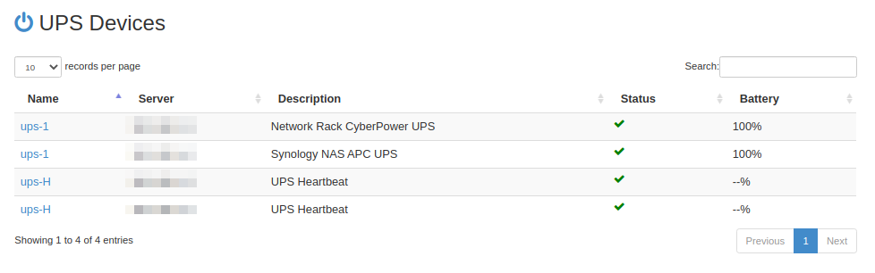
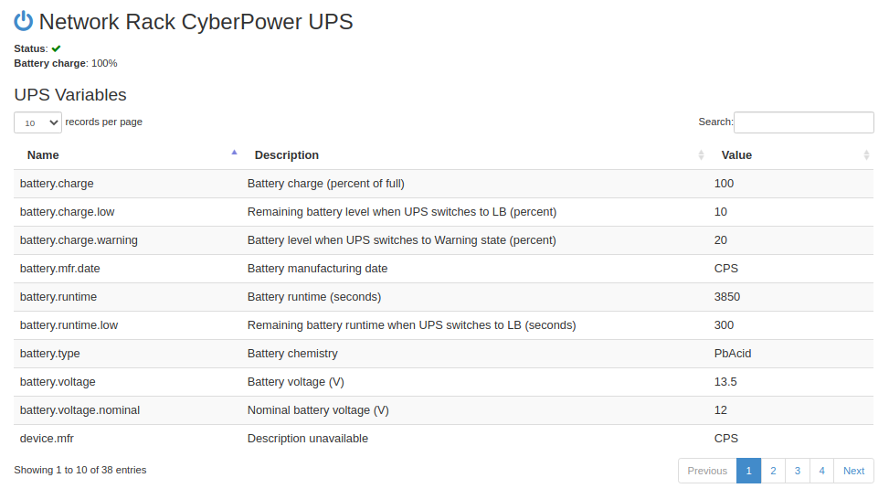

# Pi-NUT

Pi-NUT is an Ansible playbook and tools for deploying 
[Network UPS Tools, NUT](https://networkupstools.org/documentation.html) 
clients and servers onto Raspberry Pis. It supports configuration of many
UPSes with automated discovery of UPS devices connected to each Raspberry Pi 
based NUT server.

## WebNUT UPS Viewer

It uses a fork of [WebNUT](https://github.com/rshipp/webNUT) to show a list of
all UPS devices with their status and battery charge. This fork includes 
support for multiple UPS servers and other minor improvements.

Each UPS has a details page showing all the exposed NUT fields:

## NUT UPS Monitor

Work in progress...

# Project Overview

The Ansible project is laid out according to the Ansible 
[Sample directory layout](https://docs.ansible.com/ansible/latest/user_guide/sample_setup.html) 
and contains the following playbooks.

## nut_server

NUT servers collect data from connected UPS devices. A NUT server can support 
several UPS devices, limited by the number of available USB connections 
available on the Raspberry Pi. 

Each server can also be configured with a heartbeat UPS device which generates
status for a dummy UPS.

## nut_client

The NUT client connects to all NUT servers and monitors the UPS devices 
connected to them.

## nut_web

The NUT web server connects to all NUT servers and displays the state of all 
UPS devices. The WebNUT is a Python3 application running on the [Pyramid Web Framework](https://docs.pylonsproject.org/projects/pyramid/en/latest/index.html). 
The install footprint is quite large so the Raspberry Pi requires at least a 
4Gb SD card for a full install.

# Setup

Copy `hosts.example` to `hosts` and edit it. Each UPS should be connected to a 
NUT server, servers can support more than one UPS. Set `heartbeat_enabled=true`
to configure a heartbeat UPS on each server. 

Additional settings for each host can be set in individual 
`host_vars/<hostname>.yaml`. See `host_vars.example.yaml` for more details.

The `group_vars/all.yaml` file contains other global settings.

The NUT client and NUT web can be installed on the same host, which can also be 
a NUT server.

# References

Other useful pages related to this project:

* [UPS Server on Raspberry Pi](https://www.reddit.com/r/homelab/comments/5ssb5h/ups_server_on_raspberry_pi/)
* [NUT Introduction to Network UPS Tools: Configuration Examples](http://rogerprice.org/NUT/ConfigExamples.A5.pdf)